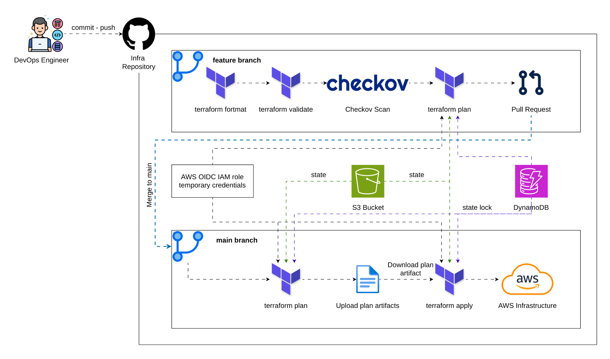

# NT548 Lab 02 — Tự động hóa Terraform bằng GitHub Actions

## 1. Lab Overview

Lab 02 tự động hóa quy trình kiểm tra và triển khai hạ tầng Terraform của [Lab 01](https://github.com/NT548-R12-DevOps-Technology/lab-01-terraform) bằng GitHub Actions. Source Terraform trong thư mục `terraform/` triển khai VPC, public/private subnet, Internet Gateway, NAT Gateway, route table, Security Group và hai EC2 theo kiến trúc của Lab 01.

Pipeline thực hiện các việc sau:

- Chạy `terraform fmt -check`, `terraform validate` và Checkov cho thay đổi trên nhánh tính năng hoặc Pull Request.
- Tạo `terraform plan` trên nhánh tính năng để review trước khi merge.
- Khi thay đổi được merge vào `main`, tạo plan từ merge commit, lưu plan artifact và `apply` chính plan đó.
- Dùng GitHub Actions OIDC để nhận AWS credentials tạm thời; không lưu AWS access key trong repository.
- Lưu Terraform state trên S3 và dùng DynamoDB lock state khi triển khai.


## 2. Luồng CI/CD



Nhánh tính năng chỉ tạo plan, không được phép apply. `main` chỉ chạy sau khi Pull Request đã được review và merge. Vì workflow trên `main` không chạy lại format/validate/Checkov, repository nên bật quy tắc bảo vệ nhánh để chỉ cho phép merge khi các kiểm tra Pull Request đã thành công.

## 3. Chuẩn bị

### 3.1. Tạo SSH key

Tạo key trên máy cá nhân; không commit private key vào repository:

```bash
mkdir -p key_pair
chmod 700 key_pair
ssh-keygen -t rsa -b 4096 -C "lab_key" -f key_pair/lab_key
chmod 400 key_pair/lab_key
```

Public key `key_pair/lab_key.pub` sẽ được lưu vào GitHub Secret `LAB_PUBLIC_KEY`. Workflow tạo file tạm trên runner trước khi chạy Terraform.

### 3.2. Tạo remote backend

S3 và DynamoDB chỉ cần tạo một lần trước khi workflow khởi tạo environment `dev`:

```bash
cd terraform/bootstrap
cp terraform.tfvars.example terraform.tfvars
```

`state_bucket_name` là tên S3 bucket **bạn tự đặt**; bootstrap sẽ tạo bucket đó, không phải lấy từ output có sẵn. Tên phải viết thường và duy nhất trên toàn AWS. Có thể tạo một tên gợi ý bằng account ID và ngày hiện tại:

```bash
ACCOUNT_ID=$(aws sts get-caller-identity --query Account --output text)
echo "lab-02-terraform-state-${ACCOUNT_ID}-$(date +%Y%m%d)"
```

Mở `terraform.tfvars`, chép kết quả vào `state_bucket_name`. Bootstrap cũng tạo OIDC provider và IAM role, nên điền GitHub repository ID trước khi apply. Lấy organization ID và repository ID bằng lệnh:

```bash
curl -fsSL https://api.github.com/repos/NT548-R12-DevOps-Technology/lab-02-terraform-github-actions \
  | jq -r '"github_organization_id = \(.owner.id)\ngithub_repository_id = \(.id)"'
```

Chép hai dòng kết quả vào `terraform.tfvars`, sau đó chạy:

```bash
terraform init
terraform fmt
terraform validate
terraform plan
terraform apply
```

Lấy output để cấu hình repository variables:

```bash
terraform output
```

### 3.3. AWS OIDC role

Root module `terraform/bootstrap/` tạo GitHub OIDC provider và IAM role cùng với S3/DynamoDB backend. Role giới hạn quyền assume cho GitHub Environment `dev` của repository này bằng immutable organization ID và repository ID. Role policy chỉ chứa các quyền Terraform cần để quản lý hạ tầng Lab 01 và remote state.

Sau khi apply bootstrap, lấy ARN role:

```bash
terraform output -raw github_actions_role_arn
```

Dùng output này làm giá trị `AWS_ROLE_TO_ASSUME`. GitHub Actions sẽ dùng OIDC để nhận AWS credentials tạm thời; không cần tạo hoặc lưu AWS access key/secret key trong repository.

Nếu AWS account đã có GitHub OIDC provider từ một lab trước, import provider vào state bootstrap trước khi apply:

```bash
ACCOUNT_ID=$(aws sts get-caller-identity --query Account --output text)
terraform import \
  module.github_actions_oidc.aws_iam_openid_connect_provider.github \
  "arn:aws:iam::${ACCOUNT_ID}:oidc-provider/token.actions.githubusercontent.com"
```

### 3.4. GitHub Environment, variables và secret

Tạo Environment tên `dev` tại **Settings → Environments**, sau đó thêm các Repository Variables:

| Variable | Giá trị |
| --- | --- |
| `AWS_REGION` | `ap-southeast-1` |
| `AWS_ROLE_TO_ASSUME` | ARN của IAM OIDC role |
| `TF_STATE_BUCKET` | Output `state_bucket_name` từ bootstrap |
| `TF_STATE_LOCK_TABLE` | Output `lock_table_name` từ bootstrap |
| `TF_VAR_AMI_ID` | AMI Linux hợp lệ trong Region |
| `TF_VAR_ALLOWED_SSH_CIDR` | Public IPv4 hiện tại kèm `/32` |

Thêm Repository Secret:

| Secret | Giá trị |
| --- | --- |
| `LAB_PUBLIC_KEY` | Nội dung một dòng của `key_pair/lab_key.pub` |

Ví dụ lấy AMI Amazon Linux 2023 x86_64:

```bash
aws ssm get-parameter \
  --region ap-southeast-1 \
  --name /aws/service/ami-amazon-linux-latest/al2023-ami-kernel-default-x86_64 \
  --query 'Parameter.Value' \
  --output text
```

Ví dụ lấy public IP để giới hạn SSH:

```bash
curl -4 --fail --silent --show-error https://checkip.amazonaws.com
```

## 4. Thực hiện CI/CD

### 4.1. Nhánh tính năng: kiểm tra và plan

```bash
git switch -c feature/terraform-change
# Chỉnh sửa Terraform
git add terraform
git commit -m "feat(terraform): describe infrastructure change"
git push -u origin feature/terraform-change
```

Push lên nhánh tính năng chạy tuần tự `format → validate → Checkov → plan`. Tạo Pull Request vào `main` để review thay đổi và plan.

### 4.2. Merge vào main: apply

Sau khi Pull Request được review và các kiểm tra thành công, merge vào `main`. Workflow tạo plan mới từ merge commit, upload artifact `terraform-dev-plan`, rồi apply artifact đó.

Không push trực tiếp vào `main`; bật quy tắc bảo vệ nhánh để bắt buộc review và các kiểm tra phải thành công trước khi merge.

## 5. Kiểm thử sau triển khai

Tạo file môi trường cho AWS CLI test:

```bash
cp testcases/.env.example testcases/.env
```

Điền các giá trị phù hợp, rồi chạy:

```bash
bash testcases/validate_aws_cli.sh
```

Script kiểm tra VPC/IGW, DNS, subnet, NAT Gateway, route table, Security Group và EC2 theo tag `Project`/`Environment`.

## 6. Cleanup

Hủy hạ tầng environment bằng máy cá nhân sau khi đã xác nhận đúng backend:

```bash
cd terraform/environments/dev
terraform init -reconfigure -backend-config=backend.hcl
terraform destroy
```

Sau khi environment đã bị hủy, nếu không dùng pipeline nữa thì vào `terraform/bootstrap` và hủy S3 backend/DynamoDB lock table. Xóa toàn bộ object và version trong S3 bucket trước khi Terraform có thể xóa bucket.
